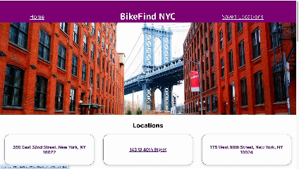

# Bike Find

## Abstract

Application uses an API to fetch information about e-bike locations in New York City. The user can click a location on the home page and be taken to another page with more details. They can save that address if they want and view it by clicking the Saved Locations button. They can also delete the address if they want as well.

### Application link:

[Bike Find](https://github.com/zenmcmillan/bike-find)

### Installation Instructions: 

1. In your terminal run `git clone git@github.com:zenmcmillan/bike-find.git`
2. Run `cd bike-find`
3. Run `npm install`. It will take a few seconds to finish
4. Run `npm start` and you should see the application in the browser

### Preview of App:

## Deployment Link

[Bike Find](https://bike-find-7944rl3f0-zen-mcmillans-projects.vercel.app/)

### Context:

This is the final project for the Front End Engineering Progam at the Turing School of Software & Design. It took 4 days to complete this project

### Contributors

[Zen McMillan](https://github.com/zenmcmillan)

### Learning Goals:

* Demonstrate foundational knowledge in:  
\- React  
\- Router   
\- Asynchronous JavaScript   
\- End to end testing with Cypress   
\- Responsive Design   
\- Error handling  
\- User Experience

### Wins & Challenges:

* Working with Router was a challenge for me. On the Saved Locations page the delete button was originally a route along with the address so figuring out how to seperate those was an challenge for me. The problem was solved once I searched through the docs and realized I needed to wrap the address within a Link.

* Another challenge was figuring out how to keep track of the saved locations within the app state.  I figured out the problem by adding an object key of saved with an initial value of false. It would change to true when the Save Location button was clicked and back to false when the delete button was clicked. This was done right after the data was fetched since my attempt to do it in a separate function only added more unneccessary code and led to other side effects.

